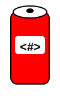

<div align="center">
  <br>
  <a href="https://github.com/dr-montasir/cans">
      
  </a>
  <br>

[](https://github.com/dr-montasir/cans)[](https://crates.io/crates/cans)[](https://docs.rs/cans)[](https://choosealicense.com/licenses/apache-2.0)[](https://crates.io/crates/cans)

  <h1>CANS</h1>

  <p>An elegant and lightweight Rust-based literal template engine for managing web content, enhanced with a world module for streamlined regional and city information, as well as robust MIME type management.</p>
</div>

## Table of Contents

- [Overview](#overview)
- [Changelog](#changelog)
- [Features](#features)
- [Installation](#installation)
- [Usage](#usage)
- [Documentation](#documentation)
- [License](#license)
- [Contributing](#contributing)
- [Donations](#donations)
- [Author](#author)

## Overview

The **CANS** templating engine is an elegant and efficient solution developed in Rust, designed for developers who prioritize simplicity and type safety. This crate allows you to create dynamic web pages and applications with minimal boilerplate code, ensuring that your templates are easy to read and maintain.

While **CANS** is optimized for seamless integration with the [Fluxor](https://crates.io/crates/fluxor) framework, it also provides the flexibility to work with any framework or content type, making it a versatile choice for a wide range of projects.

## Changelog

[](https://github.com/dr-montasir/cans/blob/main/CHANGELOG.md)

## Features

- **Simplicity**: Easy-to-read syntax that minimizes boilerplate.
- **Type Safety**: Leverages Rust's type system for safe template rendering.
- **Dynamic Content**: Supports dynamic insertion of values, loops, and conditionals.
- **Integration**: Works seamlessly with various web frameworks.

## Installation

Run the following Cargo command in your project directory:

```shell
cargo add cans
```

or add `cans` to your `Cargo.toml` file:

```toml
[dependencies]
cans = "MAJOR.MINOR.PATCH" # Replace with the latest version
```

## Usage

### Template

CANS provides robust support for templating, including support for handling HTML, looping through collections, and rendering text. Below are some examples demonstrating how to use the (`do_replace`, `do_html`, ``do_xml`, `do_json` macros, the `do_forloop`, and the `do_text` functions.

CANS provides robust support for templating, including handling various content types, looping through collections, and rendering text. Below are some examples demonstrating how to use the (`do_replace`, `do_html`, `do_xml`, `do_json`) macros, as well as the `do_forloop` and `do_text` functions.

The `do_replace` macro takes any content string or data (e.g., code, file content, templates) along with key-value pairs and replaces placeholders in the content (formatted as `{{key}}`) with the corresponding values. This macro is highly versatile and can manipulate any content of any programming language or file by substituting placeholders.

Macros for specific content types can be defined by wrapping `do_replace!`.
For example, to create a macro for CSS content:

```rust
// use cans::content::do_replace;
use cans::do_replace;

#[macro_export]
macro_rules! do_css {
    ($content:expr, $($key:ident = $val:expr),*) => {
        $crate::do_replace!($content, $($key = $val),*)
    };
}
```

Now, `do_css!` can be used to easily replace placeholders in CSS templates.

### Example: Using the do_html Macro

```rust
use cans::content::{do_html, do_text, alpine};

pub const HEAD: &str = r#"<head>
<meta charset="UTF-8">
    {{alpinejs}}
    <title>{{page_title}} Page</title>
</head>"#;

pub const HOME_TEMPLATE: &str = r#"<!DOCTYPE html>
<html>
  {{HEAD}}
  <body>
    <h1>Home Page</h1>
    <div x-data="{ open: false }">
        <button x-show="!open" @click="open = true">Show</button>
        <button x-show="open" @click="open = false">Hide</button>
        <span x-show="open">
            CANS template with Alpine.js
        </span>
    </div>
  </body>
</html>"#;

pub fn do_home_page() -> String {
    // Alpine version, e.g., "3.15.0" or "latest" for the most recent version.
    do_html!(HOME_TEMPLATE, HEAD = HEAD, alpinejs = alpine("latest"), page_title = do_text("Home"))
}

pub const ABOUT_TEMPLATE: &str = r#"<!DOCTYPE html>
<html>
  {{HEAD}}
  <body>
    <h1>About Page</h1>
    <p>
        {{component_if}}
    </p>

    <div x-data="{ count: 0 }">
        <button x-on:click="count--">Decrement</button>
        <span x-text="count"></span>
        <button x-on:click="count++">Increment</button>
    </div>
  </body>
</html>"#;

pub fn do_about_page() -> String {
    let component_if: &str;
    let x = 3;

    if x == 1 {
        component_if = "<a href='#'><i>x = 1</i></a>";
    } else if x == 2 {
        component_if = r#"<a href='#'><i>x = {{x}}</i></a>"#;
    } else {
        component_if = "<a href=\"#\"><i>x ≠ 1 & x  ≠ 2. The 'x' value is ( {{x}} )</i></a>";
    };

    do_html!(
        ABOUT_TEMPLATE,
        HEAD = HEAD,
        // Alpine version "3.10.0"
        alpinejs = alpine("3.10.0"),
        page_title = do_text("About"),
        component_if = component_if,
        x = x // x must be defined after component_if.
    )
}

fn main() {
   let home_page = do_home_page();
   println!("{}", home_page);

   let about_page = do_about_page();
   println!("{}", about_page);
}
```

```html
<!-- home page output -->
<!DOCTYPE html>
<html>
  <head>
<meta charset="UTF-8">
    <script src="https://unpkg.com/alpinejs@latest/dist/cdn.min.js" defer></script>
    <title>Home Page</title>
</head>
  <body>
    <h1>Home Page</h1>
    <div x-data="{ open: false }">
        <button x-show="!open" @click="open = true">Show</button>
        <button x-show="open" @click="open = false">Hide</button>
        <span x-show="open">
            CANS template with Alpine.js
        </span>
    </div>
  </body>
</html>
```

```html
<!-- about page output -->
<!DOCTYPE html>
<html>
  <head>
<meta charset="UTF-8">
    <script src="https://unpkg.com/alpinejs@3.10.0/dist/cdn.min.js" defer></script>
    <title>About Page</title>
</head>
  <body>
    <h1>About Page</h1>
    <p>
        <a href="#"><i>x ≠ 1 & x  ≠ 2. The 'x' value is ( 3 )</i></a>
    </p>

    <div x-data="{ count: 0 }">
        <button x-on:click="count--">Decrement</button>
        <span x-text="count"></span>
        <button x-on:click="count++">Increment</button>
    </div>
  </body>
</html>
```

### Example: Using the do_forloop Function

```rust
use cans::content::do_forloop;

fn main() {
    let items = vec!["Apple", "Banana", "Cherry"];
    let list_html = do_forloop(&items, "<ul>", "<li>", "</li>", "</ul>");
    println!("{}", list_html);
    // Output: <ul><li>Apple</li><li>Banana</li><li>Cherry</li></ul>

    let float_vector = vec![1.0, 2.0, 3.0];
    let forloop_float = do_forloop(&float_vector, "", "", "", "");
    println!("{}", forloop_float);
    // Output: 123
}
```

### Example: Using the do_xml macro

```rust
// use cans::content::do_xml;
use cans::do_xml;

let xml_content = "<note><to>{{recipient}}</to></note>";
let xml_result = do_xml!(xml_content, recipient = "Ahmed");
assert_eq!(xml_result, "<note><to>Ahmed</to></note>");
```

### Example: Using the do_json macro

```rust
// use cans::content::do_json;
use cans::do_json;

let json_content = r##"{"greeting": "{{greeting}}", "name": "{{name}}"}"##;
let json_result = do_json!(json_content, greeting = "Hi", name = "Ahmed");
assert_eq!(json_result, r##"{"greeting": "Hi", "name": "Ahmed"}"##);
```

### MIME Module

The **MIME** module in the `cans` crate provides functionalities for handling MIME types, which are essential for identifying and processing various types of files, such as HTML documents, images, and multimedia content. This module facilitates the identification, validation, and management of different MIME types used across the web, providing features such as:

- **MIME Type Detection**: Automatically determine the MIME type of a file based on its extension or content.
- **Type Validation**: Check if a specific MIME type is valid.
- **Extension Retrieval**: Retrieve file extensions associated with given MIME types.
- **Custom MIME Types**: Register and manage custom MIME types to suit specific requirements.

```rust
use cans::mime::{
    display_mime_types,
    insert_mime_types,
    manage_mime_types,
    remove_mime_types,
    set_mime_types
};

fn main() {
   // Create a new HashMap and initialize it with default MIME types
   let mut mime_types = set_mime_types();
   
   println!("Initial MIME types:");
   display_mime_types(&mime_types);
    
    // Display the default count of MIME types
    println!("The default length of MIME types: {}", mime_types.len()); // Example output: 113
    // Define an array of tuples for both already included and new MIME types
    let included_mime_types = manage_mime_types(&[
        // Already included MIME types
        ("html", "text/html"),
        ("css", "text/css"),
        ("js", "application/javascript"),
        ("svg", "image/svg+xml"),
        ("gif", "image/gif"),
        ("jpg", "image/jpeg"),
        ("txt", "text/plain"),
        ("json", "application/json"),
        // New MIME type to include
        ("some_ext", "some_mime"),
    ]);
    // Insert new MIME types into the existing HashMap
    insert_mime_types(&mut mime_types, included_mime_types);
    // Display the length after insertion
    println!(
        "The length after inserting MIME types: {}",
        mime_types.len() // Example output: 114
    );
    // Display the updated MIME types
    println!("\nAfter inserting MIME types:");
    display_mime_types(&mime_types);

    // Define an array of tuples for both pre-existing and new MIME types
    let excluded_mime_types = manage_mime_types(&[
        // Pre-existing MIME types by default
        ("html", "text/html"),
        ("css", "text/css"),
        ("js", "application/javascript"),
        ("svg", "image/svg+xml"),
        ("gif", "image/gif"),
        ("jpg", "image/jpeg"),
        ("txt", "text/plain"),
        ("json", "application/json"),
        // New MIME type that is not part of the default list
        ("some_ext", "some_mime"),
    ]);
    // Attempt to remove MIME types from the existing HashMap
    remove_mime_types(&mut mime_types, excluded_mime_types);
    // Display the length after removal
    println!(
        "The length after removing MIME types: {}",
        mime_types.len() // Example output: 105
    );
    // Display the updated MIME types
    println!("\nAfter removing MIME types:");
    display_mime_types(&mime_types);
}
```

### World Module

A module that encapsulates the management of country details, including functionalities for inserting, deleting, retrieving, and sorting countries. Additionally, it provides features for managing city information within those countries, enabling users to insert, delete, retrieve, and sort city details. This comprehensive management system allows for seamless interaction between countries and their respective cities, facilitating efficient access to geographical and administrative data. Users can efficiently reset the dataset to accommodate new data for testing purposes. The module promotes data integrity and optimal memory management through precise control over entries. It allows for easy querying and manipulation of country and city information to support various applications.

#### Complete example of using the world module

```rust
use cans::world::{City, Country};

fn main() {
    // Create the country manager instance
    let mut cm = Country::new();

    // Example of retrieving all countries
    println!("Current Countries: {:?}", cm.retrieve());

    // Inserting a new country with cities
    cm.insert_one(
        "FR",
        vec!["🇫🇷", "33", "France", "EUR", "Paris"],
        vec![
            City {
                name: "Paris",
                gmt: vec!["GMT+1", "GMT+2"],
                latitude: "48.8566",
                longitude: "2.3522",
                altitude: "35",
            },
            City {
                name: "Lyon",
                gmt: vec!["GMT+1", "GMT+2"],
                latitude: "45.763420",
                longitude: "4.834277",
                altitude: "105",
            },
        ],
    );
    println!("After Inserting FR: {:?}", cm.retrieve());

    // Inserting multiple countries at once
    let new_countries = vec![
        (
            "IT",
            vec!["🇮🇹", "39", "Italy", "EUR", "Rome"],
            vec![
                City {
                    name: "Rome",
                    gmt: vec!["GMT+1", "GMT+2"],
                    latitude: "41.9028",
                    longitude: "12.49637",
                    altitude: "21",
                },
                City {
                    name: "Milan",
                    gmt: vec!["GMT+1", "GMT+2"],
                    latitude: "45.464664",
                    longitude: "9.188540",
                    altitude: "122",
                },
            ],
        ),
        (
            "DE",
            vec!["🇩🇪", "49", "Germany", "EUR", "Berlin"],
            vec![
                City {
                    name: "Berlin",
                    gmt: vec!["GMT+1", "GMT+2"],
                    latitude: "52.520008",
                    longitude: "13.404954",
                    altitude: "34",
                },
                City {
                    name: "Munich",
                    gmt: vec!["GMT+1", "GMT+2"],
                    latitude: "48.137154",
                    longitude: "11.576124",
                    altitude: "520",
                },
            ],
        ),
        (
            "FR",
            vec!["🇫🇷", "33", "France", "EUR", "Paris"],
            vec![
                City {
                    name: "Paris",
                    gmt: vec!["GMT+1", "GMT+2"],
                    latitude: "48.8566",
                    longitude: "2.3522",
                    altitude: "35",
                },
                City {
                    name: "Lyon",
                    gmt: vec!["GMT+1", "GMT+2"],
                    latitude: "45.763420",
                    longitude: "4.834277",
                    altitude: "105",
                },
            ],
        ),
    ];

    // Example of inserting multiple countries
    cm.insert_many(new_countries);
    println!("After Inserting IT, DE and FR: {:?}", cm.retrieve());

    // Sorting countries in ascending order by name
    let sorted_asc = cm.sort_asc();
    println!("Countries Sorted Ascending: {:?}", sorted_asc);

    // Sorting countries in descending order by name
    let sorted_desc = cm.sort_desc();
    println!("Countries Sorted Descending: {:?}", sorted_desc);

    // Example to retrieve details for Sudan
    let name = cm.country_detail("SD", "name");
    println!("Country Name: {}", name); // Output the name of the country
    let flag = cm.country_detail("SD", "flag");
    println!("Flag: {}", flag); // Output the flag of the country
    let country_calling_code = cm.country_detail("SD", "calling_code");
    println!("Calling Code: {}", country_calling_code); // Output the calling code
    let capital = cm.country_detail("SD", "capital");
    println!("Capital: {}", capital); // Output the name of the capital city of Sudan

    // Retrieve the list of cities in Sudan
    let cities = cm.country_detail("SD", "cities");
    println!("Cities: {}", cities); // Output the list of cities in Sudan

    // Example of retrieving city details for Omdurman in Sudan
    let omdurman_details = cm.city_details("SD", "Omdurman");
    println!("Omdurman Details: {}", omdurman_details); // Output the details for Omdurman

    // Example of retrieving specific detail about Khartoum
    let khartoum_gmt = cm.city_detail("SD", "Khartoum", "gmt"); // Example of retrieving GMT for Khartoum
    let omdurman_altitude = cm.city_detail("SD", "Omdurman", "altitude"); // Example of retrieving altitude for Omdurman
    let bahri_altitude = cm.city_detail("SD", "Khartoum Bahri", "altitude"); // Example of retrieving altitude for Khartoum Bahri

    println!("Khartoum GMT: {}", khartoum_gmt);
    println!("Omdurman Altitude: {}", omdurman_altitude);
    println!("Khartoum Bahri Altitude: {}", bahri_altitude);

    // Example of adding a new city to an existing country (Saudi Arabia - "SA")
    let new_city = City {
        name: "Dammam",
        gmt: vec!["GMT+3"],
        latitude: "26.4201",
        longitude: "50.0888",
        altitude: "5",
    };

    // Insert the new city into Saudi Arabia
    cm.insert_one_city("SA", new_city);

    // Retrieving the updated country details to see the new city (altitude = "5")
    let updated_details_1 = cm.retrieve().get("SA").unwrap();
    println!(
        "Updated details (1) for Saudi Arabia: {:?}",
        updated_details_1
    );

    // Example of adding multiple new cities to an existing country (Saudi Arabia - "SA")
    let new_cities = vec![
        City {
            name: "Dammam",
            gmt: vec!["GMT+3"],
            latitude: "26.4201",
            longitude: "50.0888",
            altitude: "6",
        },
        City {
            name: "Khobar",
            gmt: vec!["GMT+3"],
            latitude: "26.3040",
            longitude: "50.1998",
            altitude: "15",
        },
    ];

    // Insert the new cities into Saudi Arabia
    cm.insert_many_cities("SA", new_cities);

    // Retrieving the updated country details to see the new added cities (Dammam: altitude = "6")
    let updated_details_2 = cm.retrieve().get("SA").unwrap();
    println!(
        "Updated details (2) for Saudi Arabia: {:?}",
        updated_details_2
    );
    println!("Current Countries: {:?}", cm.retrieve());

    // Fetching a country not in the database
    let invalid_country_code = "XYZ";
    let invalid_details = cm.country_details(invalid_country_code);
    println!("Invalid Country Details: {}", invalid_details);

    // Deletion examples

    // 1. Delete a single city
    cm.delete_one_city("SA", "Dammam");
    println!(
        "Cities after deleting Dammam: {:?}",
        cm.retrieve().get("SA").unwrap().cities
    );

    // 2. Delete multiple cities
    cm.delete_many_cities("SA", &["Khobar", "Jeddah"]);
    println!(
        "Cities after deleting Khobar and Jeddah: {:?}",
        cm.retrieve().get("SA").unwrap().cities
    );

    // 3. Delete all cities
    cm.delete_all_cities("SA");
    println!(
        "Cities after deleting all cities: {:?}",
        cm.retrieve().get("SA").unwrap().cities
    );

    // Testing delete_one
    cm.delete_one("FR");
    println!("After Deleting FR: {:?}", cm.retrieve());

    // Testing delete_many
    cm.delete_many(&["IT", "DE"]);
    println!("After Deleting IT and DE: {:?}", cm.retrieve());

    // Testing delete_all
    cm.delete_all();
    println!("After Deleting All: {:?}", cm.retrieve());
}
```

#### Output

```shell
Current Countries: {"DZ": Details { flag: "🇩🇿", calling_code: "213", name: "Algeria", currency: "DZD", capital: "Algiers", cities: [City { name: "Algiers", gmt: ["GMT+1"], latitude: "36.737232", longitude: "3.086472", altitude: "424" }, City { name: "Oran", gmt: ["GMT+1"], latitude: "35.69694440", longitude: "0.63305560", altitude: "0.9" }] }, "GB": Details { flag: "🇬🇧", calling_code: "44", name: "United Kingdom", currency: "GBP", capital: "London", cities: [City { name: "London", gmt: ["GMT+0", "GMT+1"], latitude: "51.509865", longitude: "-0.118092", altitude: "24" }, City { name: "Manchester", gmt: ["GMT+0", "GMT+1"], latitude: "53.4808", longitude: "-2.2426", altitude: "38" }] }, "SD": Details { flag: "🇸🇩", calling_code: "249", name: "Sudan", currency: "SDG", capital: "Khartoum", cities: [City { name: "Khartoum", gmt: ["GMT+2"], latitude: "15.5007", longitude: "32.5599", altitude: "385" }, City { name: "Omdurman", gmt: ["GMT+2"], latitude: "15.6866", longitude: "32.4752", altitude: "375" }, City { name: "Khartoum Bahri", gmt: ["GMT+2"], latitude: "15.6151", longitude: "32.552", altitude: "360" }] }, "SA": Details { flag: "🇸🇦", calling_code: "966", name: "Saudi Arabia", currency: "SAR", capital: "Riyadh", cities: [City { name: "Riyadh", gmt: ["GMT+3"], latitude: "24.7136", longitude: "46.6753", altitude: "612" }, City { name: "Jeddah", gmt: ["GMT+3"], latitude: "21.2854", longitude: "39.2376", altitude: "12" }] }, "BH": Details { flag: "🇧🇭", calling_code: "973", name: "Bahrain", currency: "BHD", capital: "Manama", cities: [City { name: "Manama", gmt: ["GMT+3"], latitude: "26.22787", longitude: "50.58565", altitude: "10" }, City { name: "Riffa", gmt: ["GMT+3"], latitude: "26.129999", longitude: "50.555000", altitude: "15" }] }, "US": Details { flag: "🇺🇸", calling_code: "1", name: "United States", currency: "USD", capital: "Washington, D.C.", cities: [City { name: "Washington, D.C.", gmt: ["GMT-5", "GMT-4"], latitude: "38.89511", longitude: "-77.03637", altitude: "125" }, City { name: "New York", gmt: ["GMT-5", "GMT-4"], latitude: "40.730610", longitude: "-73.935242", altitude: "10" }] }, "UK": Details { flag: "🇬🇧", calling_code: "44", name: "United Kingdom", currency: "GBP", capital: "London", cities: [City { name: "London", gmt: ["GMT+0", "GMT+1"], latitude: "51.509865", longitude: "-0.118092", altitude: "24" }, City { name: "Birmingham", gmt: ["GMT+0", "GMT+1"], latitude: "52.4862", longitude: "-1.8904", altitude: "150" }] }, "CA": Details { flag: "🇨🇦", calling_code: "1", name: "Canada", currency: "CAD", capital: "Ottawa", cities: [City { name: "Ottawa", gmt: ["GMT-5", "GMT-4"], latitude: "45.4215", longitude: "-75.6972", altitude: "70" }, City { name: "Toronto", gmt: ["GMT-5", "GMT-4"], latitude: "43.65107", longitude: "-79.347015", altitude: "76.5" }] }}
After Inserting FR: {"DZ": Details { flag: "🇩🇿", calling_code: "213", name: "Algeria", currency: "DZD", capital: "Algiers", cities: [City { name: "Algiers", gmt: ["GMT+1"], latitude: "36.737232", longitude: "3.086472", altitude: "424" }, City { name: "Oran", gmt: ["GMT+1"], latitude: "35.69694440", longitude: "0.63305560", altitude: "0.9" }] }, "GB": Details { flag: "🇬🇧", calling_code: "44", name: "United Kingdom", currency: "GBP", capital: "London", cities: [City { name: "London", gmt: ["GMT+0", "GMT+1"], latitude: "51.509865", longitude: "-0.118092", altitude: "24" }, City { name: "Manchester", gmt: ["GMT+0", "GMT+1"], latitude: "53.4808", longitude: "-2.2426", altitude: "38" }] }, "SD": Details { flag: "🇸🇩", calling_code: "249", name: "Sudan", currency: "SDG", capital: "Khartoum", cities: [City { name: "Khartoum", gmt: ["GMT+2"], latitude: "15.5007", longitude: "32.5599", altitude: "385" }, City { name: "Omdurman", gmt: ["GMT+2"], latitude: "15.6866", longitude: "32.4752", altitude: "375" }, City { name: "Khartoum Bahri", gmt: ["GMT+2"], latitude: "15.6151", longitude: "32.552", altitude: "360" }] }, "SA": Details { flag: "🇸🇦", calling_code: "966", name: "Saudi Arabia", currency: "SAR", capital: "Riyadh", cities: [City { name: "Riyadh", gmt: ["GMT+3"], latitude: "24.7136", longitude: "46.6753", altitude: "612" }, City { name: "Jeddah", gmt: ["GMT+3"], latitude: "21.2854", longitude: "39.2376", altitude: "12" }] }, "BH": Details { flag: "🇧🇭", calling_code: "973", name: "Bahrain", currency: "BHD", capital: "Manama", cities: [City { name: "Manama", gmt: ["GMT+3"], latitude: "26.22787", longitude: "50.58565", altitude: "10" }, City { name: "Riffa", gmt: ["GMT+3"], latitude: "26.129999", longitude: "50.555000", altitude: "15" }] }, "FR": Details { flag: "🇫🇷", calling_code: "33", name: "France", currency: "EUR", capital: "Paris", cities: [City { name: "Paris", gmt: ["GMT+1", "GMT+2"], latitude: "48.8566", longitude: "2.3522", altitude: "35" }, City { name: "Lyon", gmt: ["GMT+1", "GMT+2"], latitude: "45.763420", longitude: "4.834277", altitude: "105" }] }, "US": Details { flag: "🇺🇸", calling_code: "1", name: "United States", currency: "USD", capital: "Washington, D.C.", cities: [City { name: "Washington, D.C.", gmt: ["GMT-5", "GMT-4"], latitude: "38.89511", longitude: "-77.03637", altitude: "125" }, City { name: "New York", gmt: ["GMT-5", "GMT-4"], latitude: "40.730610", longitude: "-73.935242", altitude: "10" }] }, "UK": Details { flag: "🇬🇧", calling_code: "44", name: "United Kingdom", currency: "GBP", capital: "London", cities: [City { name: "London", gmt: ["GMT+0", "GMT+1"], latitude: "51.509865", longitude: "-0.118092", altitude: "24" }, City { name: "Birmingham", gmt: ["GMT+0", "GMT+1"], latitude: "52.4862", longitude: "-1.8904", altitude: "150" }] }, "CA": Details { flag: "🇨🇦", calling_code: "1", name: "Canada", currency: "CAD", capital: "Ottawa", cities: [City { name: "Ottawa", gmt: ["GMT-5", "GMT-4"], latitude: "45.4215", longitude: "-75.6972", altitude: "70" }, City { name: "Toronto", gmt: ["GMT-5", "GMT-4"], latitude: "43.65107", longitude: "-79.347015", altitude: "76.5" }] }}
After Inserting IT, DE and FR: {"DZ": Details { flag: "🇩🇿", calling_code: "213", name: "Algeria", currency: "DZD", capital: "Algiers", cities: [City { name: "Algiers", gmt: ["GMT+1"], latitude: "36.737232", longitude: "3.086472", altitude: "424" }, City { name: "Oran", gmt: ["GMT+1"], latitude: "35.69694440", longitude: "0.63305560", altitude: "0.9" }] }, "GB": Details { flag: "🇬🇧", calling_code: "44", name: "United Kingdom", currency: "GBP", capital: "London", cities: [City { name: "London", gmt: ["GMT+0", "GMT+1"], latitude: "51.509865", longitude: "-0.118092", altitude: "24" }, City { name: "Manchester", gmt: ["GMT+0", "GMT+1"], latitude: "53.4808", longitude: "-2.2426", altitude: "38" }] }, "SD": Details { flag: "🇸🇩", calling_code: "249", name: "Sudan", currency: "SDG", capital: "Khartoum", cities: [City { name: "Khartoum", gmt: ["GMT+2"], latitude: "15.5007", longitude: "32.5599", altitude: "385" }, City { name: "Omdurman", gmt: ["GMT+2"], latitude: "15.6866", longitude: "32.4752", altitude: "375" }, City { name: "Khartoum Bahri", gmt: ["GMT+2"], latitude: "15.6151", longitude: "32.552", altitude: "360" }] }, "SA": Details { flag: "🇸🇦", calling_code: "966", name: "Saudi Arabia", currency: "SAR", capital: "Riyadh", cities: [City { name: "Riyadh", gmt: ["GMT+3"], latitude: "24.7136", longitude: "46.6753", altitude: "612" }, City { name: "Jeddah", gmt: ["GMT+3"], latitude: "21.2854", longitude: "39.2376", altitude: "12" }] }, "BH": Details { flag: "🇧🇭", calling_code: "973", name: "Bahrain", currency: "BHD", capital: "Manama", cities: [City { name: "Manama", gmt: ["GMT+3"], latitude: "26.22787", longitude: "50.58565", altitude: "10" }, City { name: "Riffa", gmt: ["GMT+3"], latitude: "26.129999", longitude: "50.555000", altitude: "15" }] }, "FR": Details { flag: "🇫🇷", calling_code: "33", name: "France", currency: "EUR", capital: "Paris", cities: [City { name: "Paris", gmt: ["GMT+1", "GMT+2"], latitude: "48.8566", longitude: "2.3522", altitude: "35" }, City { name: "Lyon", gmt: ["GMT+1", "GMT+2"], latitude: "45.763420", longitude: "4.834277", altitude: "105" }] }, "IT": Details { flag: "🇮🇹", calling_code: "39", name: "Italy", currency: "EUR", capital: "Rome", cities: [City { name: "Rome", gmt: ["GMT+1", "GMT+2"], latitude: "41.9028", longitude: "12.49637", altitude: "21" }, City { name: "Milan", gmt: ["GMT+1", "GMT+2"], latitude: "45.464664", longitude: "9.188540", altitude: "122" }] }, "DE": Details { flag: "🇩🇪", calling_code: "49", name: "Germany", currency: "EUR", capital: "Berlin", cities: [City { name: "Berlin", gmt: ["GMT+1", "GMT+2"], latitude: "52.520008", longitude: "13.404954", altitude: "34" }, City { name: "Munich", gmt: ["GMT+1", "GMT+2"], latitude: "48.137154", longitude: "11.576124", altitude: "520" }] }, "US": Details { flag: "🇺🇸", calling_code: "1", name: "United States", currency: "USD", capital: "Washington, D.C.", cities: [City { name: "Washington, D.C.", gmt: ["GMT-5", "GMT-4"], latitude: "38.89511", longitude: "-77.03637", altitude: "125" }, City { name: "New York", gmt: ["GMT-5", "GMT-4"], latitude: "40.730610", longitude: "-73.935242", altitude: "10" }] }, "UK": Details { flag: "🇬🇧", calling_code: "44", name: "United Kingdom", currency: "GBP", capital: "London", cities: [City { name: "London", gmt: ["GMT+0", "GMT+1"], latitude: "51.509865", longitude: "-0.118092", altitude: "24" }, City { name: "Birmingham", gmt: ["GMT+0", "GMT+1"], latitude: "52.4862", longitude: "-1.8904", altitude: "150" }] }, "CA": Details { flag: "🇨🇦", calling_code: "1", name: "Canada", currency: "CAD", capital: "Ottawa", cities: [City { name: "Ottawa", gmt: ["GMT-5", "GMT-4"], latitude: "45.4215", longitude: "-75.6972", altitude: "70" }, City { name: "Toronto", gmt: ["GMT-5", "GMT-4"], latitude: "43.65107", longitude: "-79.347015", altitude: "76.5" }] }}
Countries Sorted Ascending: [Details { flag: "🇩🇿", calling_code: "213", name: "Algeria", currency: "DZD", capital: "Algiers", cities: [City { name: "Algiers", gmt: ["GMT+1"], latitude: "36.737232", longitude: "3.086472", altitude: "424" }, City { name: "Oran", gmt: ["GMT+1"], latitude: "35.69694440", longitude: "0.63305560", altitude: "0.9" }] }, Details { flag: "🇧🇭", calling_code: "973", name: "Bahrain", currency: "BHD", capital: "Manama", cities: [City { name: "Manama", gmt: ["GMT+3"], latitude: "26.22787", longitude: "50.58565", altitude: "10" }, City { name: "Riffa", gmt: ["GMT+3"], latitude: "26.129999", longitude: "50.555000", altitude: "15" }] }, Details { flag: "🇨🇦", calling_code: "1", name: "Canada", currency: "CAD", capital: "Ottawa", cities: [City { name: "Ottawa", gmt: ["GMT-5", "GMT-4"], latitude: "45.4215", longitude: "-75.6972", altitude: "70" }, City { name: "Toronto", gmt: ["GMT-5", "GMT-4"], latitude: "43.65107", longitude: "-79.347015", altitude: "76.5" }] }, Details { flag: "🇫🇷", calling_code: "33", name: "France", currency: "EUR", capital: "Paris", cities: [City { name: "Paris", gmt: ["GMT+1", "GMT+2"], latitude: "48.8566", longitude: "2.3522", altitude: "35" }, City { name: "Lyon", gmt: ["GMT+1", "GMT+2"], latitude: "45.763420", longitude: "4.834277", altitude: "105" }] }, Details { flag: "🇩🇪", calling_code: "49", name: "Germany", currency: "EUR", capital: "Berlin", cities: [City { name: "Berlin", gmt: ["GMT+1", "GMT+2"], latitude: "52.520008", longitude: "13.404954", altitude: "34" }, City { name: "Munich", gmt: ["GMT+1", "GMT+2"], latitude: "48.137154", longitude: "11.576124", altitude: "520" }] }, Details { flag: "🇮🇹", calling_code: "39", name: "Italy", currency: "EUR", capital: "Rome", cities: [City { name: "Rome", gmt: ["GMT+1", "GMT+2"], latitude: "41.9028", longitude: "12.49637", altitude: "21" }, City { name: "Milan", gmt: ["GMT+1", "GMT+2"], latitude: "45.464664", longitude: "9.188540", altitude: "122" }] }, Details { flag: "🇸🇦", calling_code: "966", name: "Saudi Arabia", currency: "SAR", capital: "Riyadh", cities: [City { name: "Riyadh", gmt: ["GMT+3"], latitude: "24.7136", longitude: "46.6753", altitude: "612" }, City { name: "Jeddah", gmt: ["GMT+3"], latitude: "21.2854", longitude: "39.2376", altitude: "12" }] }, Details { flag: "🇸🇩", calling_code: "249", name: "Sudan", currency: "SDG", capital: "Khartoum", cities: [City { name: "Khartoum", gmt: ["GMT+2"], latitude: "15.5007", longitude: "32.5599", altitude: "385" }, City { name: "Omdurman", gmt: ["GMT+2"], latitude: "15.6866", longitude: "32.4752", altitude: "375" }, City { name: "Khartoum Bahri", gmt: ["GMT+2"], latitude: "15.6151", longitude: "32.552", altitude: "360" }] }, Details { flag: "🇬🇧", calling_code: "44", name: "United Kingdom", currency: "GBP", capital: "London", cities: [City { name: "London", gmt: ["GMT+0", "GMT+1"], latitude: "51.509865", longitude: "-0.118092", altitude: "24" }, City { name: "Manchester", gmt: ["GMT+0", "GMT+1"], latitude: "53.4808", longitude: "-2.2426", altitude: "38" }] }, Details { flag: "🇬🇧", calling_code: "44", name: "United Kingdom", currency: "GBP", capital: "London", cities: [City { name: "London", gmt: ["GMT+0", "GMT+1"], latitude: "51.509865", longitude: "-0.118092", altitude: "24" }, City { name: "Birmingham", gmt: ["GMT+0", "GMT+1"], latitude: "52.4862", longitude: "-1.8904", altitude: "150" }] }, Details { flag: "🇺🇸", calling_code: "1", name: "United States", currency: "USD", capital: "Washington, D.C.", cities: [City { name: "Washington, D.C.", gmt: ["GMT-5", "GMT-4"], latitude: "38.89511", longitude: "-77.03637", altitude: "125" }, City { name: "New York", gmt: ["GMT-5", "GMT-4"], latitude: "40.730610", longitude: "-73.935242", altitude: "10" }] }]
Countries Sorted Descending: [Details { flag: "🇺🇸", calling_code: "1", name: "United States", currency: "USD", capital: "Washington, D.C.", cities: [City { name: "Washington, D.C.", gmt: ["GMT-5", "GMT-4"], latitude: "38.89511", longitude: "-77.03637", altitude: "125" }, City { name: "New York", gmt: ["GMT-5", "GMT-4"], latitude: "40.730610", longitude: "-73.935242", altitude: "10" }] }, Details { flag: "🇬🇧", calling_code: "44", name: "United Kingdom", currency: "GBP", capital: "London", cities: [City { name: "London", gmt: ["GMT+0", "GMT+1"], latitude: "51.509865", longitude: "-0.118092", altitude: "24" }, City { name: "Manchester", gmt: ["GMT+0", "GMT+1"], latitude: "53.4808", longitude: "-2.2426", altitude: "38" }] }, Details { flag: "🇬🇧", calling_code: "44", name: "United Kingdom", currency: "GBP", capital: "London", cities: [City { name: "London", gmt: ["GMT+0", "GMT+1"], latitude: "51.509865", longitude: "-0.118092", altitude: "24" }, City { name: "Birmingham", gmt: ["GMT+0", "GMT+1"], latitude: "52.4862", longitude: "-1.8904", altitude: "150" }] }, Details { flag: "🇸🇩", calling_code: "249", name: "Sudan", currency: "SDG", capital: "Khartoum", cities: [City { name: "Khartoum", gmt: ["GMT+2"], latitude: "15.5007", longitude: "32.5599", altitude: "385" }, City { name: "Omdurman", gmt: ["GMT+2"], latitude: "15.6866", longitude: "32.4752", altitude: "375" }, City { name: "Khartoum Bahri", gmt: ["GMT+2"], latitude: "15.6151", longitude: "32.552", altitude: "360" }] }, Details { flag: "🇸🇦", calling_code: "966", name: "Saudi Arabia", currency: "SAR", capital: "Riyadh", cities: [City { name: "Riyadh", gmt: ["GMT+3"], latitude: "24.7136", longitude: "46.6753", altitude: "612" }, City { name: "Jeddah", gmt: ["GMT+3"], latitude: "21.2854", longitude: "39.2376", altitude: "12" }] }, Details { flag: "🇮🇹", calling_code: "39", name: "Italy", currency: "EUR", capital: "Rome", cities: [City { name: "Rome", gmt: ["GMT+1", "GMT+2"], latitude: "41.9028", longitude: "12.49637", altitude: "21" }, City { name: "Milan", gmt: ["GMT+1", "GMT+2"], latitude: "45.464664", longitude: "9.188540", altitude: "122" }] }, Details { flag: "🇩🇪", calling_code: "49", name: "Germany", currency: "EUR", capital: "Berlin", cities: [City { name: "Berlin", gmt: ["GMT+1", "GMT+2"], latitude: "52.520008", longitude: "13.404954", altitude: "34" }, City { name: "Munich", gmt: ["GMT+1", "GMT+2"], latitude: "48.137154", longitude: "11.576124", altitude: "520" }] }, Details { flag: "🇫🇷", calling_code: "33", name: "France", currency: "EUR", capital: "Paris", cities: [City { name: "Paris", gmt: ["GMT+1", "GMT+2"], latitude: "48.8566", longitude: "2.3522", altitude: "35" }, City { name: "Lyon", gmt: ["GMT+1", "GMT+2"], latitude: "45.763420", longitude: "4.834277", altitude: "105" }] }, Details { flag: "🇨🇦", calling_code: "1", name: "Canada", currency: "CAD", capital: "Ottawa", cities: [City { name: "Ottawa", gmt: ["GMT-5", "GMT-4"], latitude: "45.4215", longitude: "-75.6972", altitude: "70" }, City { name: "Toronto", gmt: ["GMT-5", "GMT-4"], latitude: "43.65107", longitude: "-79.347015", altitude: "76.5" }] }, Details { flag: "🇧🇭", calling_code: "973", name: "Bahrain", currency: "BHD", capital: "Manama", cities: [City { name: "Manama", gmt: ["GMT+3"], latitude: "26.22787", longitude: "50.58565", altitude: "10" }, City { name: "Riffa", gmt: ["GMT+3"], latitude: "26.129999", longitude: "50.555000", altitude: "15" }] }, Details { flag: "🇩🇿", calling_code: "213", name: "Algeria", currency: "DZD", capital: "Algiers", cities: [City { name: "Algiers", gmt: ["GMT+1"], latitude: "36.737232", longitude: "3.086472", altitude: "424" }, City { name: "Oran", gmt: ["GMT+1"], latitude: "35.69694440", longitude: "0.63305560", altitude: "0.9" }] }]
Country Name: Sudan
Flag: 🇸🇩
Calling Code: 249
Capital: Khartoum
Cities: [{ "name": "Khartoum", "gmt": ["GMT+2"], "latitude": "15.5007", "longitude": "32.5599", "altitude": "385" }, { "name": "Omdurman", "gmt": ["GMT+2"], "latitude": "15.6866", "longitude": "32.4752", "altitude": "375" }, { "name": "Khartoum Bahri", "gmt": ["GMT+2"], "latitude": "15.6151", "longitude": "32.552", "altitude": "360" }]
Omdurman Details: { "name": "Omdurman", "gmt": ["GMT+2"], "latitude": "15.6866", "longitude": "32.4752", "altitude": "375" }
Khartoum GMT: GMT+2
Omdurman Altitude: 375
Khartoum Bahri Altitude: 360
Updated details (1) for Saudi Arabia: Details { flag: "🇸🇦", calling_code: "966", name: "Saudi Arabia", currency: "SAR", capital: "Riyadh", cities: [City { name: "Riyadh", gmt: ["GMT+3"], latitude: "24.7136", longitude: "46.6753", altitude: "612" }, City { name: "Jeddah", gmt: ["GMT+3"], latitude: "21.2854", longitude: "39.2376", altitude: "12" }, City { name: "Dammam", gmt: ["GMT+3"], latitude: "26.4201", longitude: "50.0888", altitude: "5" }] }
Updated details (2) for Saudi Arabia: Details { flag: "🇸🇦", calling_code: "966", name: "Saudi Arabia", currency: "SAR", capital: "Riyadh", cities: [City { name: "Riyadh", gmt: ["GMT+3"], latitude: "24.7136", longitude: "46.6753", altitude: "612" }, City { name: "Jeddah", gmt: ["GMT+3"], latitude: "21.2854", longitude: "39.2376", altitude: "12" }, City { name: "Dammam", gmt: ["GMT+3"], latitude: "26.4201", longitude: "50.0888", altitude: "6" }, City { name: "Khobar", gmt: ["GMT+3"], latitude: "26.3040", longitude: "50.1998", altitude: "15" }] }
Current Countries: {"DZ": Details { flag: "🇩🇿", calling_code: "213", name: "Algeria", currency: "DZD", capital: "Algiers", cities: [City { name: "Algiers", gmt: ["GMT+1"], latitude: "36.737232", longitude: "3.086472", altitude: "424" }, City { name: "Oran", gmt: ["GMT+1"], latitude: "35.69694440", longitude: "0.63305560", altitude: "0.9" }] }, "GB": Details { flag: "🇬🇧", calling_code: "44", name: "United Kingdom", currency: "GBP", capital: "London", cities: [City { name: "London", gmt: ["GMT+0", "GMT+1"], latitude: "51.509865", longitude: "-0.118092", altitude: "24" }, City { name: "Manchester", gmt: ["GMT+0", "GMT+1"], latitude: "53.4808", longitude: "-2.2426", altitude: "38" }] }, "SD": Details { flag: "🇸🇩", calling_code: "249", name: "Sudan", currency: "SDG", capital: "Khartoum", cities: [City { name: "Khartoum", gmt: ["GMT+2"], latitude: "15.5007", longitude: "32.5599", altitude: "385" }, City { name: "Omdurman", gmt: ["GMT+2"], latitude: "15.6866", longitude: "32.4752", altitude: "375" }, City { name: "Khartoum Bahri", gmt: ["GMT+2"], latitude: "15.6151", longitude: "32.552", altitude: "360" }] }, "SA": Details { flag: "🇸🇦", calling_code: "966", name: "Saudi Arabia", currency: "SAR", capital: "Riyadh", cities: [City { name: "Riyadh", gmt: ["GMT+3"], latitude: "24.7136", longitude: "46.6753", altitude: "612" }, City { name: "Jeddah", gmt: ["GMT+3"], latitude: "21.2854", longitude: "39.2376", altitude: "12" }, City { name: "Dammam", gmt: ["GMT+3"], latitude: "26.4201", longitude: "50.0888", altitude: "6" }, City { name: "Khobar", gmt: ["GMT+3"], latitude: "26.3040", longitude: "50.1998", altitude: "15" }] }, "BH": Details { flag: "🇧🇭", calling_code: "973", name: "Bahrain", currency: "BHD", capital: "Manama", cities: [City { name: "Manama", gmt: ["GMT+3"], latitude: "26.22787", longitude: "50.58565", altitude: "10" }, City { name: "Riffa", gmt: ["GMT+3"], latitude: "26.129999", longitude: "50.555000", altitude: "15" }] }, "FR": Details { flag: "🇫🇷", calling_code: "33", name: "France", currency: "EUR", capital: "Paris", cities: [City { name: "Paris", gmt: ["GMT+1", "GMT+2"], latitude: "48.8566", longitude: "2.3522", altitude: "35" }, City { name: "Lyon", gmt: ["GMT+1", "GMT+2"], latitude: "45.763420", longitude: "4.834277", altitude: "105" }] }, "IT": Details { flag: "🇮🇹", calling_code: "39", name: "Italy", currency: "EUR", capital: "Rome", cities: [City { name: "Rome", gmt: ["GMT+1", "GMT+2"], latitude: "41.9028", longitude: "12.49637", altitude: "21" }, City { name: "Milan", gmt: ["GMT+1", "GMT+2"], latitude: "45.464664", longitude: "9.188540", altitude: "122" }] }, "DE": Details { flag: "🇩🇪", calling_code: "49", name: "Germany", currency: "EUR", capital: "Berlin", cities: [City { name: "Berlin", gmt: ["GMT+1", "GMT+2"], latitude: "52.520008", longitude: "13.404954", altitude: "34" }, City { name: "Munich", gmt: ["GMT+1", "GMT+2"], latitude: "48.137154", longitude: "11.576124", altitude: "520" }] }, "US": Details { flag: "🇺🇸", calling_code: "1", name: "United States", currency: "USD", capital: "Washington, D.C.", cities: [City { name: "Washington, D.C.", gmt: ["GMT-5", "GMT-4"], latitude: "38.89511", longitude: "-77.03637", altitude: "125" }, City { name: "New York", gmt: ["GMT-5", "GMT-4"], latitude: "40.730610", longitude: "-73.935242", altitude: "10" }] }, "UK": Details { flag: "🇬🇧", calling_code: "44", name: "United Kingdom", currency: "GBP", capital: "London", cities: [City { name: "London", gmt: ["GMT+0", "GMT+1"], latitude: "51.509865", longitude: "-0.118092", altitude: "24" }, City { name: "Birmingham", gmt: ["GMT+0", "GMT+1"], latitude: "52.4862", longitude: "-1.8904", altitude: "150" }] }, "CA": Details { flag: "🇨🇦", calling_code: "1", name: "Canada", currency: "CAD", capital: "Ottawa", cities: [City { name: "Ottawa", gmt: ["GMT-5", "GMT-4"], latitude: "45.4215", longitude: "-75.6972", altitude: "70" }, City { name: "Toronto", gmt: ["GMT-5", "GMT-4"], latitude: "43.65107", longitude: "-79.347015", altitude: "76.5" }] }}
Invalid Country Details: { "flag": "", "calling_code": "", "name": "", "capital": "", "currency": "", "cities": [] }
Cities after deleting Dammam: [City { name: "Riyadh", gmt: ["GMT+3"], latitude: "24.7136", longitude: "46.6753", altitude: "612" }, City { name: "Jeddah", gmt: ["GMT+3"], latitude: "21.2854", longitude: "39.2376", altitude: "12" }, City { name: "Khobar", gmt: ["GMT+3"], latitude: "26.3040", longitude: "50.1998", altitude: "15" }]
Cities after deleting Khobar and Jeddah: [City { name: "Riyadh", gmt: ["GMT+3"], latitude: "24.7136", longitude: "46.6753", altitude: "612" }]
Cities after deleting all cities: []
After Deleting FR: {"DZ": Details { flag: "🇩🇿", calling_code: "213", name: "Algeria", currency: "DZD", capital: "Algiers", cities: [City { name: "Algiers", gmt: ["GMT+1"], latitude: "36.737232", longitude: "3.086472", altitude: "424" }, City { name: "Oran", gmt: ["GMT+1"], latitude: "35.69694440", longitude: "0.63305560", altitude: "0.9" }] }, "GB": Details { flag: "🇬🇧", calling_code: "44", name: "United Kingdom", currency: "GBP", capital: "London", cities: [City { name: "London", gmt: ["GMT+0", "GMT+1"], latitude: "51.509865", longitude: "-0.118092", altitude: "24" }, City { name: "Manchester", gmt: ["GMT+0", "GMT+1"], latitude: "53.4808", longitude: "-2.2426", altitude: "38" }] }, "SD": Details { flag: "🇸🇩", calling_code: "249", name: "Sudan", currency: "SDG", capital: "Khartoum", cities: [City { name: "Khartoum", gmt: ["GMT+2"], latitude: "15.5007", longitude: "32.5599", altitude: "385" }, City { name: "Omdurman", gmt: ["GMT+2"], latitude: "15.6866", longitude: "32.4752", altitude: "375" }, City { name: "Khartoum Bahri", gmt: ["GMT+2"], latitude: "15.6151", longitude: "32.552", altitude: "360" }] }, "SA": Details { flag: "🇸🇦", calling_code: "966", name: "Saudi Arabia", currency: "SAR", capital: "Riyadh", cities: [] }, "BH": Details { flag: "🇧🇭", calling_code: "973", name: "Bahrain", currency: "BHD", capital: "Manama", cities: [City { name: "Manama", gmt: ["GMT+3"], latitude: "26.22787", longitude: "50.58565", altitude: "10" }, City { name: "Riffa", gmt: ["GMT+3"], latitude: "26.129999", longitude: "50.555000", altitude: "15" }] }, "IT": Details { flag: "🇮🇹", calling_code: "39", name: "Italy", currency: "EUR", capital: "Rome", cities: [City { name: "Rome", gmt: ["GMT+1", "GMT+2"], latitude: "41.9028", longitude: "12.49637", altitude: "21" }, City { name: "Milan", gmt: ["GMT+1", "GMT+2"], latitude: "45.464664", longitude: "9.188540", altitude: "122" }] }, "DE": Details { flag: "🇩🇪", calling_code: "49", name: "Germany", currency: "EUR", capital: "Berlin", cities: [City { name: "Berlin", gmt: ["GMT+1", "GMT+2"], latitude: "52.520008", longitude: "13.404954", altitude: "34" }, City { name: "Munich", gmt: ["GMT+1", "GMT+2"], latitude: "48.137154", longitude: "11.576124", altitude: "520" }] }, "US": Details { flag: "🇺🇸", calling_code: "1", name: "United States", currency: "USD", capital: "Washington, D.C.", cities: [City { name: "Washington, D.C.", gmt: ["GMT-5", "GMT-4"], latitude: "38.89511", longitude: "-77.03637", altitude: "125" }, City { name: "New York", gmt: ["GMT-5", "GMT-4"], latitude: "40.730610", longitude: "-73.935242", altitude: "10" }] }, "UK": Details { flag: "🇬🇧", calling_code: "44", name: "United Kingdom", currency: "GBP", capital: "London", cities: [City { name: "London", gmt: ["GMT+0", "GMT+1"], latitude: "51.509865", longitude: "-0.118092", altitude: "24" }, City { name: "Birmingham", gmt: ["GMT+0", "GMT+1"], latitude: "52.4862", longitude: "-1.8904", altitude: "150" }] }, "CA": Details { flag: "🇨🇦", calling_code: "1", name: "Canada", currency: "CAD", capital: "Ottawa", cities: [City { name: "Ottawa", gmt: ["GMT-5", "GMT-4"], latitude: "45.4215", longitude: "-75.6972", altitude: "70" }, City { name: "Toronto", gmt: ["GMT-5", "GMT-4"], latitude: "43.65107", longitude: "-79.347015", altitude: "76.5" }] }}
After Deleting IT and DE: {"DZ": Details { flag: "🇩🇿", calling_code: "213", name: "Algeria", currency: "DZD", capital: "Algiers", cities: [City { name: "Algiers", gmt: ["GMT+1"], latitude: "36.737232", longitude: "3.086472", altitude: "424" }, City { name: "Oran", gmt: ["GMT+1"], latitude: "35.69694440", longitude: "0.63305560", altitude: "0.9" }] }, "GB": Details { flag: "🇬🇧", calling_code: "44", name: "United Kingdom", currency: "GBP", capital: "London", cities: [City { name: "London", gmt: ["GMT+0", "GMT+1"], latitude: "51.509865", longitude: "-0.118092", altitude: "24" }, City { name: "Manchester", gmt: ["GMT+0", "GMT+1"], latitude: "53.4808", longitude: "-2.2426", altitude: "38" }] }, "SD": Details { flag: "🇸🇩", calling_code: "249", name: "Sudan", currency: "SDG", capital: "Khartoum", cities: [City { name: "Khartoum", gmt: ["GMT+2"], latitude: "15.5007", longitude: "32.5599", altitude: "385" }, City { name: "Omdurman", gmt: ["GMT+2"], latitude: "15.6866", longitude: "32.4752", altitude: "375" }, City { name: "Khartoum Bahri", gmt: ["GMT+2"], latitude: "15.6151", longitude: "32.552", altitude: "360" }] }, "SA": Details { flag: "🇸🇦", calling_code: "966", name: "Saudi Arabia", currency: "SAR", capital: "Riyadh", cities: [] }, "BH": Details { flag: "🇧🇭", calling_code: "973", name: "Bahrain", currency: "BHD", capital: "Manama", cities: [City { name: "Manama", gmt: ["GMT+3"], latitude: "26.22787", longitude: "50.58565", altitude: "10" }, City { name: "Riffa", gmt: ["GMT+3"], latitude: "26.129999", longitude: "50.555000", altitude: "15" }] }, "US": Details { flag: "🇺🇸", calling_code: "1", name: "United States", currency: "USD", capital: "Washington, D.C.", cities: [City { name: "Washington, D.C.", gmt: ["GMT-5", "GMT-4"], latitude: "38.89511", longitude: "-77.03637", altitude: "125" }, City { name: "New York", gmt: ["GMT-5", "GMT-4"], latitude: "40.730610", longitude: "-73.935242", altitude: "10" }] }, "UK": Details { flag: "🇬🇧", calling_code: "44", name: "United Kingdom", currency: "GBP", capital: "London", cities: [City { name: "London", gmt: ["GMT+0", "GMT+1"], latitude: "51.509865", longitude: "-0.118092", altitude: "24" }, City { name: "Birmingham", gmt: ["GMT+0", "GMT+1"], latitude: "52.4862", longitude: "-1.8904", altitude: "150" }] }, "CA": Details { flag: "🇨🇦", calling_code: "1", name: "Canada", currency: "CAD", capital: "Ottawa", cities: [City { name: "Ottawa", gmt: ["GMT-5", "GMT-4"], latitude: "45.4215", longitude: "-75.6972", altitude: "70" }, City { name: "Toronto", gmt: ["GMT-5", "GMT-4"], latitude: "43.65107", longitude: "-79.347015", altitude: "76.5" }] }}
After Deleting All: {}
```

## Documentation

For a detailed API reference, visit the [CANS Documentation](https://docs.rs/cans/latest/cans).

## Contributing

Contributions are welcome! If you have suggestions or improvements, feel free to submit an issue or a pull request.

## License

This project is licensed under the MIT or Apache 2.0 License - see the LICENSE file for details.

## Conclusion

Whether you're building a small project or a large application, CANS provides the tools you need to create dynamic and flexible templates with ease. Unlock the potential of CANS to elevate your Rust web development experience!

## Donations

If you appreciate the work on CANS and would like to support its development, you can make a donation using USDT (TRC-20). Your contributions will help us continue to improve the project and maintain its features.

**Donate with USDT (TRC-20)**

- Wallet Address: [`TFtKw3aExk5fXvdmTobiVDBbkbJB66wc6D`](https://tronscan.org/#/address/TFtKw3aExk5fXvdmTobiVDBbkbJB66wc6D)

**Donate with USDC (TRC-20)**

- Wallet Address: [`TFtKw3aExk5fXvdmTobiVDBbkbJB66wc6D`](https://tronscan.org/#/address/TFtKw3aExk5fXvdmTobiVDBbkbJB66wc6D)

**Donate with TRON (TRX)**

- Wallet Address: [`TFtKw3aExk5fXvdmTobiVDBbkbJB66wc6D`](https://tronscan.org/#/address/TFtKw3aExk5fXvdmTobiVDBbkbJB66wc6D)

Thank you for your support!

---

## Author

[Dr. Montasir Mirghani](https://github.com/dr-montasir)
